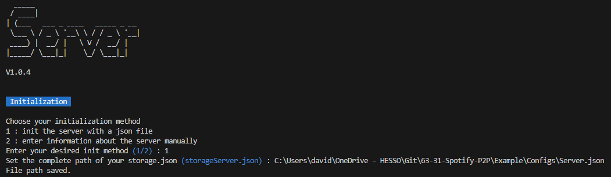
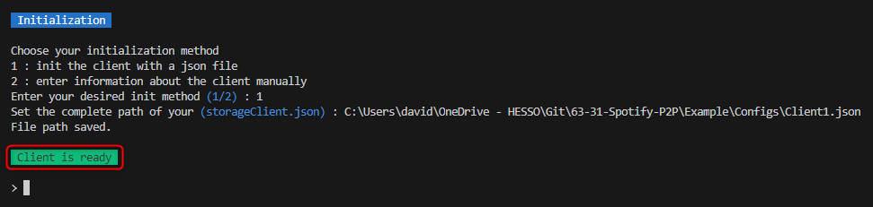
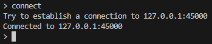

# Quick Start Guide

## Prerequisites

As the same as the [build.md](Build.md) file you need to have Java 17+ installed on the device you want to use the server and the client.

And you will need to use the Example folder to help you to configure your client.

To run our project you just need to go to the target folder and run the following command:

> depending on your ide or you terminal you may need to add the `java -jar xxx.jar 'client'` when you run the command

### Start the server

```bash
java -jar 63-31-Spotify-P2P-jar-with-dependencies.jar server # if you are in the target folder or if you are in the same folder of your .jar 
```

the server will start and this message will appear:
choose the option 1 and and enter the full path of the server.json configuration file.
This json file can be found in the example folder. It name is server.json



### Start the clients

here i will show you how to start 1 client but you can start as many as you want and in the example folder you will find 2 clients configuration.

```bash
java -jar 63-31-Spotify-P2P-jar-with-dependencies.jar client  # if you are in the target folder or if you are in the same folder of your .jar 
```

you will be asked to choos between two options:

- 1: load a configuration of the client from a file
- 2: create a new configuration by entering the information manually

choose the option 1 and and enter the full path of the client1.json configuration file.

the client will start. and this message will appear:



## Use the client

first you need to connect your client to the server. to do that you need to enter the following command:

```bash
connect # don't forget to start the server first if you didn't do it yet
```

this message should appear:



once you are connected you can use the following command to see all the available commands on the client:

```bash
help
```

this command will show you all the available commands on the client and you can also see the description of each command with the following command:

```bash
help <command>
```
